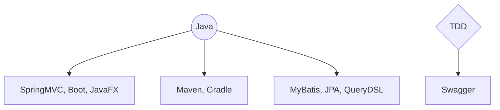
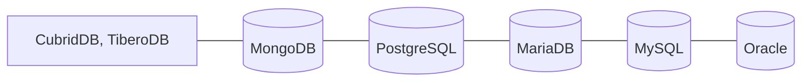
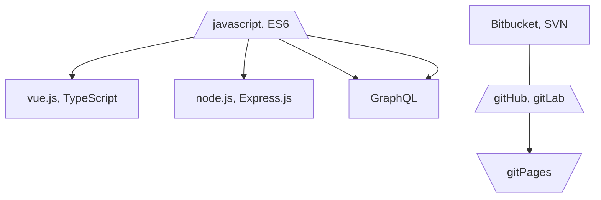
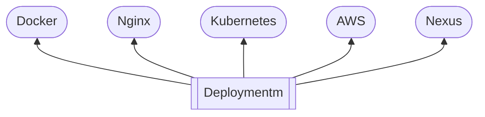

# Hey👋, It's ABarthDew
My gitHub name is an anagram - Guess what word it is🤣   
Anyway, Here it is my page: https://abarthdew.github.io/

### ✨Tech Stack
```mermaid
%%{init: { 'logLevel': 'debug', 'theme': 'base', 'gitGraph': {'showBranches': true, 'showCommitLabel':true,'mainBranchName': 'FRONT'}} }%%
      gitGraph
        commit id:"jQuery"
        commit id:"Javascript"
        branch BACK
        
        commit id:"JAVA"
        commit id:"SpringMVC"
        commit id:"SpringBoot"
        commit type: HIGHLIGHT id:"JavaFX"
        commit id:"Node.js"
        commit id:"Express.js"
        commit id:"GraphQL"
        branch MetroLine3
        commit id:"Oracle"
        commit id:"Tibero"
        commit id:"Maria"
        commit id:"MySQL"
        commit id:"Mongo"
        commit type: HIGHLIGHT id:"PostgreSQL"
        commit id:"Typescript"
        checkout FRONT
        commit id:"VUE.js"
        merge DBMS
        commit id:"ES6"
        merge BACK tag:"MY JUNCTION"
        commit id:"React" type: REVERSE
```


> DO: Java, SpringMVC, Boot, Maven, Gradle, MyBatis, JPA, QueryDSL, TDD, Swagger, Oracle, MySQL, MariaDB, PostgreSQL, MongoDB, CubridDB, TiberoDB, javascript, ES6, vue.js, TypeScript, node.js, Express.js, JQuery, Thymeleaf, Bitbucket, SVN, gitHub, gitLab, Docker, Kubernetes, Nexus
{: .prompt-tip }
   
> TODO: DO, Docker, Kubernetes, GraphQL, Nginx, AWS, etc
{: .prompt-info }


   

   

   

