# Hey👋, It's ABarthDew
My gitHub name is an anagram - Guess what word it is🤣   
Anyway, Here it is my page: https://abarthdew.github.io/

### ✨History

```mermaid
timeline
    title History of Tech Stack
    ~2019 : PLSQL : SQL : EXCEL
    2019 : JAVA : SpringMVC : MAVEN : Servlet : JSP : Javascript : jQuery : ORACLE : MyBatis : gitHub : Bootstrap
    2020 : MSA : REST api : JAVA : SpringBoot : Gradle : JPA : Vue2 : ES6 : ElementUI : ORACLE
    2021 : Vue3 : Vuetify : MongoDB : Node.js : Express.js : TypeScript : QueryDSL : MySQL : PostgreSQL : Swagger : Docker
    2022 : JAVA : SpringBoot : Javascrip : jQuery : Tibero : Cubrid : Thymeleaf : 전자정부프레임워크 : Bitbuckit : SVN : Kubernetes
    2023 : JAVA : SpringBoot : Vue2 : Javascript : Gradle : Tibero : gitLab
```

### 💻Tech Stack

  <!-- back -->
  
  
  
  
  

  <!-- front -->
  
  
  
  
  <!-- db -->
  
  
  
  
  
  <!-- deploy -->
  
  
  
  <!-- tdd -->
  
 
  <!-- git -->
  
  
  
  
  

  <!-- etc -->
  
  
  
  
  
  

### 📚Learning

  
  
  
  
  
  
  

### 📊GitHub Stats :

 
 

## References
- [icon](https://devicon.dev/)
